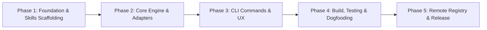

# Implementation Plan: Ergon

**Product:** Ergon — Universal Skill & Persona Registry for Autonomous Coding Agents  
**Version:** 1.0.0  
**Status:** Approved for Implementation  
**Author:** Kairos (Tech Lead & Planner)  

---

## 1. Overview & Phased Roadmap

This plan outlines the end-to-end implementation of the Ergon CLI and its canonical skill registry. Tasks are organized topologically so that core data structures and prompts are locked before adapter logic and CLI ergonomics are built.

---

## 2. Phase Breakdown & Atomic Tasks

### Phase 1: Project Setup & Canonical Skill Registry

*Goal: Scaffold the TypeScript project, build system, test runner, and author all 8 persona skills + composite foundation pipeline.*

- [ ] **Task 1.1: Project Toolchain Scaffolding**
  - Initialize `package.json` with dependencies: `commander`, `@clack/prompts`, `picocolors`, `yaml`, `zod`.
  - Dev dependencies: `typescript`, `tsup`, `vitest`, `@types/node`.
  - Configure `tsconfig.json` (strict mode, NodeNext module resolution).
  - Configure `tsup.config.ts` (target node18+, ESM/CJS outputs, bundle `skills/` directory).
  - Add test harness with `vitest.config.ts`.
  - *Acceptance Criteria:* `pnpm build` (or `npm run build`) and `pnpm test` execute without errors.

- [ ] **Task 1.2: Foundation Persona Skills Authoring**
  - Create `skills/foundation/market/` (`skill.yaml`, `prompt.md` for **Cyra**).
  - Create `skills/foundation/prd/` (`skill.yaml`, `prompt.md` for **Juno**).
  - Create `skills/foundation/arch/` (`skill.yaml`, `prompt.md` for **Orion**).
  - Create `skills/foundation/plan/` (`skill.yaml`, `prompt.md` for **Kairos**).
  - Create `skills/foundation/pipeline/` (`skill.yaml`, `prompt.md` for `/foundation` 4-pass sequential bootstrapper).
  - *Acceptance Criteria:* Each skill has a validated YAML manifest and high-signal, self-contained prompt markdown.

- [ ] **Task 1.3: Specialist Persona Skills Authoring**
  - Create `skills/specialists/backend/` (`skill.yaml`, `prompt.md` for **Kael**).
  - Create `skills/specialists/frontend/` (`skill.yaml`, `prompt.md` for **Iris**).
  - Create `skills/specialists/qa/` (`skill.yaml`, `prompt.md` for **Argus**).
  - Create `skills/specialists/sec/` (`skill.yaml`, `prompt.md` for **Aegis**).
  - *Acceptance Criteria:* Each specialist manifest defines triggers and cross-runner destination rules.

---

### Phase 2: Core Manifest Engine & Runner Adapters

*Goal: Build the runner detection, manifest validation, and transformation adapters with full unit test coverage.*

- [ ] **Task 2.1: Types & Zod Manifest Validator**
  - Implement `src/types/index.ts` (shared types for runners, manifests, adapters).
  - Implement `src/core/manifest.ts` using `zod` to validate `skill.yaml` structure and bundle arrays.
  - Write unit tests in `tests/manifest.test.ts`.
  - *Acceptance Criteria:* Invalid manifests throw structured errors; valid manifests return strongly typed objects.

- [ ] **Task 2.2: Workspace Runner Detector**
  - Implement `src/core/detector.ts` to detect `.claude`, `.codex`, `.agy`, and `.cursor` in target root.
  - Write unit tests in `tests/detector.test.ts` covering single, multiple, and empty runner directories.
  - *Acceptance Criteria:* Accurately identifies all present runners in a workspace.

- [ ] **Task 2.3: Runner Adapters Implementation**
  - Implement `src/adapters/base.ts` (abstract `RunnerAdapter` interface: `transform(manifest, prompt): AdapterOutput`).
  - Implement `src/adapters/claude.ts` (inverts prompt into `.claude/commands/<id>.md` with frontmatter and `$ARGUMENTS`).
  - Implement `src/adapters/codex.ts` (outputs `.codex/skills/<id>/SKILL.md`).
  - Implement `src/adapters/agy.ts` (outputs `.agy/skills/<id>.md`).
  - Implement `src/adapters/cursor.ts` (outputs `.cursor/rules/<id>.mdc`).
  - Write unit tests in `tests/adapters.test.ts` verifying exact string outputs for all 4 targets.
  - *Acceptance Criteria:* Every adapter produces syntactically valid files matching target runner specifications.

- [ ] **Task 2.4: Atomic File System Writer**
  - Implement `src/core/writer.ts` (directory scaffolding, atomic `.tmp` writes, overwrite protection, collision detection).
  - Write unit tests in `tests/writer.test.ts`.
  - *Acceptance Criteria:* Avoids overwriting existing files unless `overwrite: true` is passed.

---

### Phase 3: CLI Commands & Terminal UX

*Goal: Wire up user-facing commands using Commander and Clack for polished CLI ergonomics.*

- [ ] **Task 3.1: Skill Resolver Engine**
  - Implement `src/core/resolver.ts` to discover and load skills from bundled `skills/` directory.
  - Support bundle expansion (e.g. `foundation` expanding to `market`, `prd`, `arch`, `plan`, and `pipeline`).
  - *Acceptance Criteria:* Resolves any persona or bundle ID to its manifest and prompt content.

- [ ] **Task 3.2: `ergon init` Command**
  - Implement `src/commands/init.ts`.
  - Runs runner detector. If none detected, prompts user with `@clack/prompts` multi-select.
  - Automatically installs core development bundle (foundation + specialists).
  - Displays summary table with installed commands.
  - *Acceptance Criteria:* `ergon init` in a fresh repository configures all commands in one pass.

- [ ] **Task 3.3: `ergon add <target>` Command**
  - Implement `src/commands/add.ts`.
  - Supports `--runner <target>` flag for explicit runner targeting.
  - Handles single skill or bundle installation with interactive progress spinners.
  - *Acceptance Criteria:* `ergon add market --runner claude` correctly creates `.claude/commands/market.md`.

- [ ] **Task 3.4: `ergon list` Command**
  - Implement `src/commands/list.ts`.
  - Renders formatted terminal table of available personas, triggers, and descriptions.
  - *Acceptance Criteria:* Outputs clean readable list of all built-in skills.

---

### Phase 4: Packaging, Integration Testing & Release

*Goal: Bundle the CLI executable, run integration tests against mock workspaces, and document usage.*

- [ ] **Task 4.1: Executable Binary Scaffolding**
  - Implement `bin/ergon.js` with shebang `# !/usr/bin/env node`.
  - Connect to compiled `dist/index.js`.
  - Verify executable permissions and npm `bin` mapping.
  - *Acceptance Criteria:* Running `node bin/ergon.js list` functions identically to global command.

- [ ] **Task 4.2: End-to-End Integration Testing**
  - Implement `tests/e2e.test.ts` running compiled binary against fixture directories (empty repo, Claude repo, Cursor repo).
  - Test `ergon init`, `ergon add`, and `--force` overwrite flag.
  - *Acceptance Criteria:* All end-to-end tests pass in automated test runner.

- [ ] **Task 4.3: Documentation & Repository Polish**
  - Update `README.md` with installation guides, persona overview table, and command reference.
  - Verify GitHub repository remote sync and push.
  - *Acceptance Criteria:* Clean, comprehensive documentation ready for public use.
