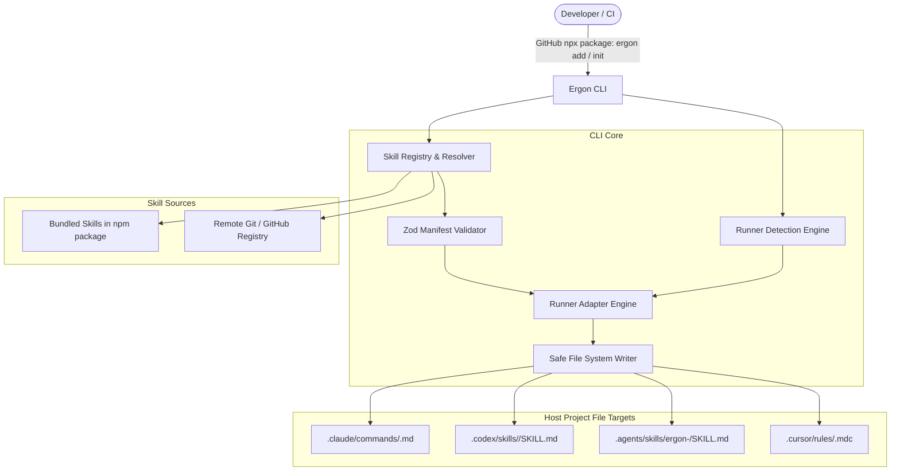

# System Design Document: Ergon

**Product:** Ergon — Universal Skill & Persona Registry for Autonomous Coding Agents  
**Version:** 1.0.0  
**Status:** Approved for Implementation  
**Author:** Orion (System Architect)  

---

## 1. System Overview & Architectural Principles

Ergon is a lightweight, zero-dependency-runtime CLI package and curated registry designed to configure autonomous coding agents across fragmented ecosystems (Claude Code, OpenAI Codex CLI, Antigravity `agy`, Cursor, and Windsurf).

### Guiding Principles

1. **Vendor-Neutral Canonical Storage:** Skills and personas are authored in standard Markdown and declarative YAML manifests. No vendor-locked schemas in the source registry.
2. **Deterministic Transpilation:** The CLI dynamically transforms generic canonical manifests into runner-native command formats (`.claude/commands/*.md`, `.codex/skills/*/SKILL.md`, `.cursor/rules/*.mdc`, etc.) with zero runtime overhead.
3. **Local & Offline First:** Bundled default skills install instantly without internet access. Remote community registries fall back gracefully to local caches.
4. **Zero-Friction Repo Integration:** Safe file writing, non-destructive collision checks, explicit `--force` overrides, and automatic workspace runner detection.

---

## 2. High-Level Architecture



---

## 3. Repository & Workspace Structure

Ergon is organized as a unified repository pairing the CLI engine with canonical skill definitions:

```text
ergon/
├── PRD.md
├── SYSTEM_DESIGN.md
├── PLAN.md
├── README.md
├── package.json               # Root npm workspace / CLI manifest
├── tsconfig.json              # Strict TypeScript configuration
├── tsup.config.ts             # CLI bundle configuration (ESM + CJS binary)
├── bin/
│   └── ergon.js               # Executable binary entry point (# !/usr/bin/env node)
├── src/
│   ├── index.ts               # CLI command orchestrator (Commander / Clack)
│   ├── commands/
│   │   ├── init.ts            # 'ergon init' command logic
│   │   ├── add.ts             # 'ergon add <skill>' command logic
│   │   └── list.ts            # 'ergon list' command logic
│   ├── core/
│   │   ├── detector.ts        # Agent runner workspace detection
│   │   ├── resolver.ts        # Local bundled + remote git skill fetcher
│   │   ├── manifest.ts        # Zod schema & YAML validator
│   │   └── writer.ts          # Atomic file writer & collision handler
│   ├── adapters/
│   │   ├── base.ts            # Base runner adapter interface
│   │   ├── claude.ts          # Claude Code adapter (.claude/commands/)
│   │   ├── codex.ts           # Codex CLI adapter (.codex/skills/)
│   │   ├── agy.ts             # Antigravity adapter (.agents/skills/)
│   │   └── cursor.ts          # Cursor / Windsurf adapter (.cursor/rules/)
│   └── types/
│       └── index.ts           # Shared TypeScript interfaces & types
├── skills/                    # Canonical Vendor-Neutral Skill Registry
│   ├── foundation/
│   │   ├── market/            # Cyra (Market Researcher)
│   │   │   ├── skill.yaml
│   │   │   └── prompt.md
│   │   ├── prd/               # Juno (Product Manager)
│   │   │   ├── skill.yaml
│   │   │   └── prompt.md
│   │   ├── arch/              # Orion (System Architect)
│   │   │   ├── skill.yaml
│   │   │   └── prompt.md
│   │   ├── plan/              # Kairos (Tech Lead & Planner)
│   │   │   ├── skill.yaml
│   │   │   └── prompt.md
│   │   └── pipeline/          # Composite 4-Pass /foundation pipeline
│   │       ├── skill.yaml
│   │       └── prompt.md
│   └── specialists/
│       ├── backend/           # Kael (Senior Backend Engineer)
│       │   ├── skill.yaml
│       │   └── prompt.md
│       ├── frontend/          # Iris (Senior Frontend Developer)
│       │   ├── skill.yaml
│       │   └── prompt.md
│       ├── qa/                # Argus (QA Automation Specialist)
│       │   ├── skill.yaml
│       │   └── prompt.md
│       └── sec/               # Aegis (Application Security Auditor)
│           ├── skill.yaml
│           └── prompt.md
└── tests/
    ├── detector.test.ts
    ├── adapters.test.ts
    ├── resolver.test.ts
    └── cli.test.ts
```

---

## 4. Component Decomposition & Logic Flow

### 4.1 Runner Detection Engine (`src/core/detector.ts`)

The detector inspects the current working directory to identify configured agent environments:

| Runner ID | Detection Markers | Target Configuration Output |
| :--- | :--- | :--- |
| `claude` | `.claude/` exists, or `CLAUDE.md` in root | `.claude/commands/<id>.md` |
| `codex` | `.codex/` exists | `.codex/skills/<id>/SKILL.md` |
| `agy` | `.agents/skills/`, `.agents/workflows/`, or `antigravity.yaml` exists | `.agents/skills/ergon-<persona>/SKILL.md` |
| `cursor` | `.cursor/` or `.cursorrules` exists | `.cursor/rules/<id>.mdc` |

* **Fallback Behavior:** If no runner marker is detected during `ergon init`, the CLI presents an interactive multi-select menu via `@clack/prompts` to let the developer choose target runners.

### 4.2 Manifest Schema & Validation (`src/core/manifest.ts`)

Every skill must define a valid `skill.yaml` matching this Zod schema:

```typescript
import { z } from 'zod';

export const RunnerTargetSchema = z.object({
  claude: z.string().optional(),
  codex: z.string().optional(),
  agy: z.string().optional(),
  cursor: z.string().optional(),
});

export const SkillManifestSchema = z.object({
  id: z.string().regex(/^[a-z0-9-]+$/),
  name: z.string().min(1),
  persona: z.string().min(1),
  version: z.string().default('1.0.0'),
  description: z.string().min(5),
  triggers: z.array(z.string()).min(1),
  targets: RunnerTargetSchema.optional(),
  bundle: z.array(z.string()).optional(), // If composite bundle (e.g. foundation)
});

export type SkillManifest = z.infer<typeof SkillManifestSchema>;
```

### 4.3 Runner Adapter Transformation Pipeline (`src/adapters/`)

The transformation engine accepts canonical `SkillManifest` + `prompt.md` and yields runner-native files:

#### 1. Claude Code Adapter (`.claude/commands/<id>.md`)
* Injects frontmatter:
  ```markdown
  ---
  description: <description>
  ---
  ```
* Interpolates `$ARGUMENTS` placeholder so developers can pass runtime instructions (e.g., `/backend add stripe webhook`).

#### 2. OpenAI Codex Adapter (`.codex/skills/<id>/SKILL.md`)
* Creates dedicated skill directory `.codex/skills/<id>/`.
* Injects YAML header formatted for Codex skill execution and schema parameter bindings.

#### 3. Antigravity Adapter (`.agents/skills/ergon-<persona>/SKILL.md`)
* Emits a standard Agent Skill with `name` and `description` frontmatter so Antigravity can discover it semantically and expose it as `/ergon-<persona>`.

#### 4. Cursor / Windsurf Adapter (`.cursor/rules/<id>.mdc`)
* Injects MDC frontmatter:
  ```markdown
  ---
  description: <description>
  globs: *
  alwaysApply: false
  ---
  ```

---

## 5. CLI Execution Lifecycle

### Command: `ergon init`
1. **Discover:** Run `RunnerDetector` on host repository.
2. **Prompt:** If no runners detected, prompt developer to select primary runner(s).
3. **Install Core Suite:** Automatically installs:
   - Foundation Suite (`Cyra`, `Juno`, `Orion`, `Kairos`, and `/foundation`)
   - Specialist Suite (`Kael`, `Iris`, `Argus`, `Aegis`)
4. **Summary:** Emits a formatted Clack table showing installed slash commands and their file paths.

### Command: `ergon add <target>`
1. **Target Evaluation:** Check whether `<target>` is:
   - A single persona (`market`, `prd`, `arch`, `plan`, `backend`, `frontend`, `qa`, `sec`).
   - A bundle (`foundation`, `specialists`).
   - A community skill (`github-user/repo:skill-name`).
2. **Resolution:** Fetch canonical assets from bundled store or remote repository.
3. **Transformation:** Run matching adapters for all active runners (or `--runner <type>` override).
4. **Write:** Write files safely. If target exists and `--force` is omitted, prompt for overwrite approval.

### Command: `ergon list`
* Scans available bundled and registered skills, printing name, persona, trigger, and description.

---

## 6. Security, Reliability & Performance

1. **No External Network Dependencies for Defaults:** All default foundation and specialist skills are bundled inside the published npm package (`dist/skills/`). Works completely offline.
2. **Atomic Writes:** File writing uses temporary files (`.tmp.<filename>`) before moving to destination path, preventing partial or corrupt file generation.
3. **Zero Telemetry:** Ergon respects developer privacy; no telemetry, tracking, or remote phone-home pings are executed.
4. **Execution Guarantees:** Ergon strictly generates Markdown instructions and YAML manifests. It does not spawn background runtimes or modify repository source code directly.
